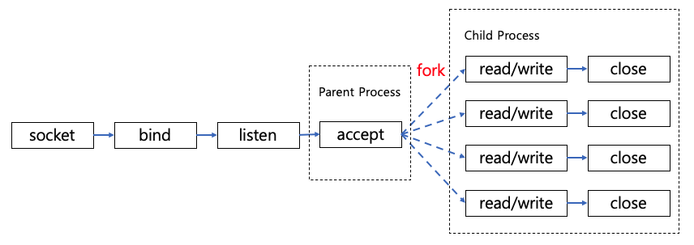

# 멀티프로세스 기반 다중 접속 통신
- 멀티프로세싱 기반의 다중 접속 서버는 다수의 프로세스를 생성하는 방식으로 서비스를 제공한다


## 동작 과정 
1. 부모 프로세스는 리스닝 소켓으로 accept 함수를 호출해서 연결 요청을 수락한다.
2. 이때 얻는 소켓의 파일 디스크립터(클라이언트와 연결된 연결 소켓)를 자식 프로세스를 생성해 넘겨준다.
3. 자식 프로세스는 전달받은 파일 디스크립터를 바탕으로 서비스를 제공한다.

## 장점
- 단순하고 안정적이다 
- 각 프로세스는 서로 독립된 메모리 공간을 갖기 떄문에 race condition이 없다 

## 단점	
- context switch 비용 비쌈 
- 병렬 처리하는 수 만큼 프로세스 생성하여 리소스 낭비 
- 각 프로세스간 정보 교환 비용 비쌈

<br>

# server 
```
> ./echo_multi_process_server 3000
new client connected...
new client connected...
```

<br>

# client1
```
> ./echo_client 127.0.0.1 3000
Connected...........
Input message(Q to quit): 123
Message from server: 123
```

<br>

# client2
```
> ./echo_client 127.0.0.1 3000
Connected...........
Input message(Q to quit): 456
Message from server: 456
```

---
https://engineering.linecorp.com/ko/blog/do-not-block-the-event-loop-part1#mcetoc_1gdcaies0s